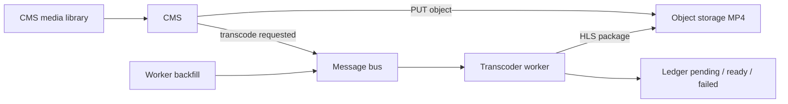

Here’s a pattern that shows up on almost every content-heavy public site.

Editors drop a video into the CMS media library — a hero, a media-center clip, a page background, a case-study reel. The public page asks for a same-origin path under something like `/storage/...`. An edge proxy or gateway sends that path to object storage. Images and PDFs feel instant. A large progressive MP4 does not. The browser has to pull one big file before playback feels smooth. Raising the proxy timeout keeps the connection alive. It does not make the first frame arrive sooner.

You do not need a new storage product, and you do not need editors to upload a second file. Keep the original MP4 where the CMS put it. A background worker writes an HLS package next to it. **Any** public player that knows the MP4 path can derive the sibling playlist, use it when it exists, and keep the progressive file when it does not.

Homepage heroes are one consumer of that rule. Media centers and other content pages are the same pipeline.

## Three jobs, three places

The work splits cleanly if you refuse to run ffmpeg on the request path.

| Role | What it owns |
| --- | --- |
| **CMS** | Media library writes the original video to object storage and publishes a small “please transcode this” message. It does not encode. |
| **Transcoder worker** | Consumes the message, encodes the HLS package, writes it beside the source object, and records `pending` / `ready` / `failed` in a ledger. Backfill for old files lives here too. |
| **Public web app** | Content already supplies the MP4 path as text. The player derives the sibling playlist, tries HLS, and keeps the MP4 when the playlist is missing or broken. |

Shared infrastructure they already had:

- a **message bus** for the transcode request (topic + queue with prefetch 1)
- a **database ledger** keyed by object identity and content version (ETag)
- **object storage** for both the original and the HLS tree
- an **edge / gateway** that routes `/storage/...` to the filer and can set `Cache-Control` on public media

What stays off this path: scanners that only touch citizen or form uploads, admin UIs that preview covers and PDFs, and any service that would otherwise be tempted to “just run ffmpeg in the CMS pod.”

## What HLS changes

HTTP Live Streaming chops the video into short segments and publishes a playlist. When the source is tall enough, encode a few rungs (for example 1080p, 720p, 480p). The player starts on a rung that can fill a small buffer, then steps up. The sharp picture is still there. Playback does not wait for the entire file.

A typical object layout:

```text
media/clips/intro.mp4                 # original, unchanged
media/clips/intro/hls/master.m3u8     # what the player asks for
media/clips/intro/hls/1080p/index.m3u8
media/clips/intro/hls/1080p/seg_00001.ts
media/clips/intro/hls/720p/...
media/clips/intro/hls/480p/...
```

Playlists use relative segment URLs, so they keep working under the same public `/storage/...` prefix as the MP4. The path shape does not care which page field pointed at the file.

## Which files qualify

There is no magic minimum duration. A file is a candidate when:

- the extension is a video type the worker supports (for example `.mp4`, `.mov`, `.webm`, `.m4v`)
- it is the **source** object, not something already under an `hls/` folder
- size is greater than 0 and under a hard ceiling (we used 2 GB)
- that exact content version is not already `ready` in the ledger

Images and PDFs are ignored. Put the “is this a source video?” check in **one** shared place so the CMS publisher and the worker cannot disagree. Deriving `…/intro/hls/master.m3u8` from `…/intro.mp4` must be deterministic. A segment path is never a source, so the worker does not transcode its own output.

Qualify on **object**, not on **page**. If it is a video in the library, it gets a package. Pages that embed it later inherit the same playlist rule.

## Two flows, not one

Loading a public page must **not** enqueue ffmpeg. Upload/transcode and streaming are separate.

**Upload and transcode.** An editor uses the CMS media library. The CMS writes the binary to object storage and publishes one small message (object key, bucket, optional ETag, size, correlation id, reason `upload` or `backfill`). The worker consumes it, writes the HLS tree, and updates the ledger.



**Streaming.** Whatever page is rendering — homepage, media center, article — already has a text path to the MP4. The public app loads bytes from `/storage/...`. That request goes to object storage (via the edge). It does not go through the CMS or the message bus.


ffmpeg does not run inside the CMS process or inside the web pod. Those stay responsive. The heavy work is a queued job — the same pattern you already use for other asynchronous platform work.

### 1. CMS: file vs content field

Editors usually do **two** things, and that distinction matters for every feature that embeds video.

**The file.** Upload into the media library. The CMS media store writes the stream to object storage. On create (and on move), a handler publishes the transcode message and returns immediately. It does not copy the file and it does not wait for encode. If the message cannot be published, the upload still succeeds; backfill repairs it later.

**The content field.** Separately, a page, section, or media-center item stores a **text** path to that media object. That field is not the video. Recipes can set the text without uploading bytes. If the file was copied into the bucket outside the media-library hook, only backfill will notice, because no create event fired.

Keep the message small. The worker should re-read the live ETag from storage. That value, not a stale CMS field, decides whether this version has already been encoded.

### 2. Worker: one encode at a time

Run the consumer with **prefetch 1**. One large ffmpeg job should not stack on top of another in the same process.

For each job:

1. Reject keys that are not source videos.
2. Read the object. If the create hook fired before the PUT finished, the first attempt may miss the file — throw and let the broker retry.
3. Skip when the ledger already says `ready` for this key **and** this ETag.
4. Download, probe dimensions and audio, encode the rungs.
5. Delete any previous `hls/` prefix, upload the new package, **then** mark `ready`.

Record deterministic encoder failures as `failed` and stop retrying forever. Delete a partial playlist first so the site never serves a broken master. **Never overwrite the original MP4.** Transient storage errors stay retryable.

Silent files (no audio track) are common for backgrounds and some product clips. Probe for audio; if there is none, encode without an audio stream instead of failing the whole package.

### 3. Backfill for files that never saw a create event

Videos uploaded before the worker existed, or dropped into the bucket by hand, never publish a create event. One backfill command inside the worker lists video objects, skips any key whose current ETag is already `ready`, and publishes the same message shape with reason `backfill`. Running it again is safe.

Replacing the MP4 under the same key changes the ETag. The old `ready` row no longer matches, so the new file is queued. Until that job finishes, the previous playlist is still what browsers find at `.../hls/master.m3u8` — usually better than a blank player.

### 4. One player rule for every embed

Every public embed can keep the progressive path from content. The shared player derives the sibling playlist and probes it. Safari can play HLS natively; other browsers use a small HLS client library. If the probe fails, or playback errors, stay on the MP4.

Sketch of the client rule:

```ts
const playlistUrl = deriveHlsMasterPlaylistUrl(src);
const response = await fetch(playlistUrl, { signal: controller.signal });
if (!response.ok) {
  return; // keep the MP4
}

if (video.canPlayType("application/vnd.apple.mpegurl")) {
  video.src = playlistUrl;
  return;
}

const player = new (await import("hls.js")).default();
player.loadSource(playlistUrl);
player.attachMedia(video);
```

Start the `<video>` element with the MP4 `src`, so a missing playlist never leaves a blank player. When the playlist loads, switch. Looping backgrounds seek to the start at `ended`; media-center clips can omit that.

Feature-specific UI (autoplay, mute, captions, poster) sits **above** this rule. It should not fork a second storage or encode path.

## Cache what the browser already paid for

Send a long-lived public cache header on the storage route (for example `Cache-Control: public, max-age=86400`). The first visit downloads the playlist and the segments of the rung that actually played. A refresh within that window can hit disk cache on that machine. Another visitor still downloads from origin.

Two limits are worth stating out loud:

- Only the rendition that was played is cached. Other rungs download if the player switches.
- Segment URLs often stay stable when the file is replaced. Browsers can keep old segments until the TTL expires. A hard refresh picks up the new package.

The edge adds the header. It does not have to *be* a full media CDN on day one. An edge cache in front of object storage can come later.

## What we deliberately left alone

- Upload scanners that protect form or citizen uploads stay on their own path. They do not become the transcoder.
- Features that still play progressive MP4 today can adopt the same playlist rule later; once the worker is producing packages, that flip is mostly a player change.
- Admin preview routes for covers and PDFs do not need the long media cache.

## Failure modes worth designing for

| Failure | Preferred behavior |
| --- | --- |
| Transcode message lost on upload | Upload still succeeds; backfill heals |
| Worker races the PUT | Retry until the object appears |
| Encoder fails deterministically | Mark `failed`, delete partial HLS, keep MP4 |
| Playlist not ready yet | Player stays on MP4 |
| Source replaced under same key | New ETag → new job; old playlist until ready |
| Silent video (no audio track) | Encode without audio, do not fail |

## The point

Public video is a **playback** problem and an **async job** problem. Treating it as “make the proxy timeout longer” only hides the cost.

Keep the progressive original as the durable editor artifact. Encode HLS beside it on a dedicated worker behind a queue. Key the ledger on content version, not just path. Let every public embed try the playlist and fall back without ever calling the transcoder on page load.

Upload path ≠ stream path. That one sentence is most of the design. Which page embeds the file is a content concern, not a pipeline fork.
